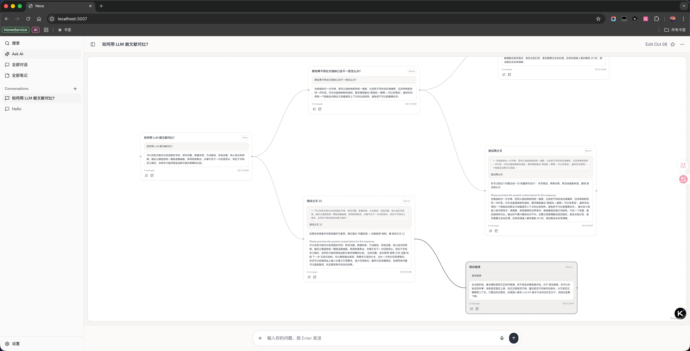

# Nexa

中文 | [English](./README.en.md)

**Nexa 是一个面向深度研究与知识沉淀的 LLM 交互 IDE。**

不同于传统的线性聊天界面，Nexa 将 LLM 对话升级为可视化的知识探索工具——你可以随时从任意回答分叉出新问题，在图谱中追踪思考脉络，让每一次对话都成为可回溯、可积累的知识资产。



## 为什么需要 Nexa？

在使用传统 LLM 聊天工具时，我们常常会遇到这些困扰：

- **追问打断主线**——想深入探讨某个观点，又怕丢失当前话题的上下文
- **对话难以回顾**——多轮讨论后，想找回之前的某个论点却淹没在长对话中
- **知识无法沉淀**——有价值的讨论分散在各个会话中，难以整理和复用

Nexa 用「分叉对话 + 知识图谱」的思路解决这些问题。

## 核心功能

### 🌿 分叉式对话

选中任意回答的片段，即可发起新的追问分支。每个分支独立发展，互不干扰，你可以随时回到任意节点继续探索。

- 在文献研究时，对某个论点进行多角度追问
- 在编程调试时，针对报错信息同时尝试多种解决方案
- 在学习新领域时，对陌生概念进行纵深探索

### 🕸️ 可视化图谱

对话不再是一条直线，而是一张可缩放、可拖拽的思维图谱：

- **拓扑视图**——直观展示问题的衍生路径和思考脉络
- **节点聚焦**——聚焦到任意节点，查看其完整上下文
- **分支对比**——并行查看不同分支的回答，辅助决策

### 📝 笔记与标签

将对话中的洞察一键保存为笔记，构建个人知识库：

- **手动标签**——为笔记和对话打上自定义标签
- **自动标签**——系统自动提取关键词，辅助内容组织
- **全局搜索**——通过关键词快速定位历史内容

### 🎯 模型分层路由

根据任务复杂度自动选择不同层级的模型：

- **高/中/低三层配置**——复杂推理、日常对话、轻量任务各取所需
- **后台任务优化**——批量处理自动使用轻量模型，节约成本

## 快速开始

前置依赖：`Node.js 20+`、`npm`、`Rust stable`（桌面端）

```bash
npm install
npm run dev
```

## macOS 桌面版

```bash
# 开发模式
npm run dev:macos

# 构建发布版本
npm run release:macos
```

## 技术栈

- **前端**：Next.js 14 + React 18 + TypeScript + Tailwind CSS
- **图谱**：React Flow 实现交互式节点图
- **桌面端**：Tauri（Rust）
- **本地存储**：SQLite

## 许可证

本项目采用 **GNU Affero General Public License v3.0**（**AGPL-3.0-only**）。
如需商业闭源发布，请联系作者获取单独商业授权。
